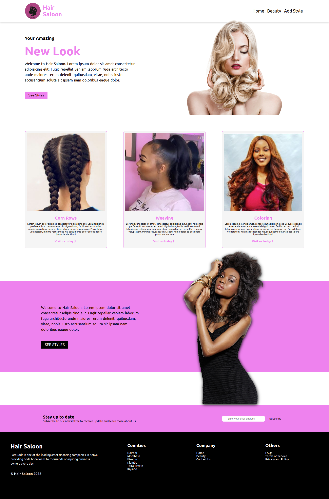

# Hair Saloon

> By Masooma Punjwani

Hair Saloon App is a solution that assists women dress their hair as relevant and as stylish as possible for both formal and informal setting. The app gives suggestions on hair styles that are appealing and even gives users an option to add their own styles in the spirit of collaboration. This is a major solution to women because it readily offers assistance on physical appearance which makes a very huge impact when interacting with others.


## Table of Content
- [Title](#Hair-Saloon)
- [Technologies](#Built-With)
- [Description](#Description)
- [Screenshot](#screenshot)
- [Getting Started](#Getting-Started)


## Built With

- HTML
- CSS
- JavaScript
- React JS
- Public API for data

## Description

The Hair Saloon App is a react web applicatin that offers suggestion hairstyles to ladies with the aim of reducing time spent looking for hair solutions. The app also provides style ratings from individuals.


## Screenshot



## Live Demo Link

(https://saloon-sigma.vercel.app)


## Getting Started

**To get a local copy up and running follow these steps:**

# Getting Started with Create React App

This project was bootstrapped with [Create React App](https://github.com/facebook/create-react-app).

## Available Scripts

In the project directory, you can run:

### `npm start`

Runs the app in the development mode.\
Open [http://localhost:3000](http://localhost:3000) to view it in your browser.

The page will reload when you make changes.\
You may also see any lint errors in the console.


### `npm run build`

Builds the app for production to the `build` folder.\
It correctly bundles React in production mode and optimizes the build for the best performance.

The build is minified and the filenames include the hashes.\
Your app is ready to be deployed!

See the section about [deployment](https://facebook.github.io/create-react-app/docs/deployment) for more information.


### Prerequisites
You need an IDE of your choice (preferably Visual Studio Code).
You will need a browser (preferably Chrome) to view the webpage.
You need to have installed npm and JSON-server on your local machine. 

### Setup
Clone the project using these links depending on your local environment using https or ssh

### Install
- After a successful clone, move into the project directory and run ``npm install`` to install the required node modules
- Next, run ``json-server --watch db.json`` to boot the server/backend
- Then run ``npm start`` to start the react app.

- If you haven't installed json-server, use ``npm -i -g json-server`` to install the server on a global scope
- Open terminal and navigate into the project root folder, run ``ls`` to check if a file ```db.json``` is present then run ``json-server --watch db.json`` to start the server.

### Usage
- Make sure your json-server is running for the app to work as intended.
- The project requires an internet connection to work because information is fetched from an external source.

### Deployment
[Link to deployed work](https://saloon-sigma.vercel.app)


## Author

👤 **Masooma Punjwani**

- GitHub: [masoomapunjwani](https://github.com/masoomapunjwani)

## 📝 License

MIT License

Copyright (c) 2022 Masooma Punjwani

Permission is hereby granted, free of charge, to any person obtaining a copy
of this software and associated documentation files (the "Software"), to deal
in the Software without restriction, including without limitation the rights
to use, copy, modify, merge, publish, distribute, sublicense, and/or sell
copies of the Software, and to permit persons to whom the Software is
furnished to do so, subject to the following conditions:

The above copyright notice and this permission notice shall be included in all
copies or substantial portions of the Software.

THE SOFTWARE IS PROVIDED "AS IS", WITHOUT WARRANTY OF ANY KIND, EXPRESS OR
IMPLIED, INCLUDING BUT NOT LIMITED TO THE WARRANTIES OF MERCHANTABILITY,
FITNESS FOR A PARTICULAR PURPOSE AND NONINFRINGEMENT. IN NO EVENT SHALL THE
AUTHORS OR COPYRIGHT HOLDERS BE LIABLE FOR ANY CLAIM, DAMAGES OR OTHER
LIABILITY, WHETHER IN AN ACTION OF CONTRACT, TORT OR OTHERWISE, ARISING FROM,
OUT OF OR IN CONNECTION WITH THE SOFTWARE OR THE USE OR OTHER DEALINGS IN THE
SOFTWARE.
